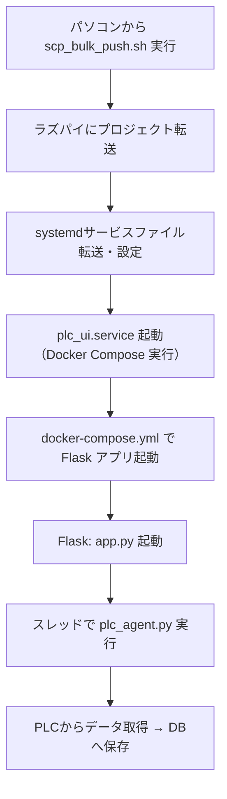

# PLC UIシステム導入手順書

このドキュメントでは、PLC UI監視システムの構築と運用のための手順を、ローカル環境（開発用）とラズパイ（本番用）で分けて説明します。

---

## ✅ 前提環境（共通）

導入作業の前に以下のソフトウェアをPC（作業端末）にインストールしておいてください：

- Docker Desktop（必須）
- Git（必須）
- Python 3.10以降（推奨）
- OpenSSH（Windowsの場合はオプション機能で有効化）

> ※ ラズパイ本体にも `docker`, `docker-compose`, `python3`, `pip`, `systemd` が必要です（通常のRaspberry Pi OSでは導入済みか確認してください）。

---

## 🧪 ローカル（開発環境）での起動方法

### 1. プロジェクトのクローン

```bash
git clone https://github.com/your-repo/raspi_plc_ui.git
cd raspi_plc_ui
```

### 2. `.env` ファイルの作成

```env
POSTGRES_USER=plc_user
POSTGRES_PASSWORD=plc_pass
POSTGRES_DB=plc_monitor
POSTGRES_PORT=5432
DATABASE_URL=postgresql://plc_user:plc_pass@db:5432/plc_monitor
FLASK_APP=manage.py
FLASK_ENV=development
PGCLIENTENCODING=utf-8
USE_DUMMY_PLC=true
```

### 3. Docker起動

```bash
docker compose up --build
```

### 4. ブラウザでアクセス

```url
http://localhost:5000
※ ラズパイにHDMIディスプレイやタッチパネルが接続されている前提です。
※ 別のPCからアクセスしたい場合は、ラズパイのIPアドレスを使用してください（例： `http://192.168.0.101:5000/equipment_config`）。
```

---

## 🚀 本番（ラズパイ）への導入手順

### 0. 前提

- ラズパイにあらかじめ以下がインストールされている必要があります：
  - Docker + Docker Compose
  - systemd
  - SSH接続可能であること（ユーザー: `pi`）

### 1. ラズパイのIPアドレスを `ip_list.csv` に記載

```csv
ip_address
192.168.0.101
192.168.0.102
```

### 2. 一括転送＆systemd登録スクリプトの実行

```bash
bash scp_bulk_push.sh
```

> 📦 内容：
> - プロジェクトフォルダを `/home/pi/` に転送
> - `plc_ui.service` を `/etc/systemd/system/` に設置
> - `docker compose up` を systemd 経由で起動＆永続化

### 3. 初回起動（ラズパイ側）

自動で起動後、ラズパイのIPにブラウザでアクセスすると、まずログイン画面が表示されます：

```
http://localhost:5001
```

#### 🔐 認証情報
- **初回ログイン**: ユーザー名 `admin`、パスワード `admin123`
- **設定完了後**: ユーザー名 `admin`、パスワード（初期設定で設定したもの）

ログイン後、初期設定画面でPLCのIPやメーカー情報に加えて、**セキュリティ設定（パスワード）**も設定してください。設定が保存されると、自動的にデータ収集・ログ保存が開始されます。

#### 🔒 新機能: セキュリティ設定
初期設定画面では、運用中の設定変更に必要なパスワードを設定できます：
- **設定変更パスワード**: 6文字以上で設定
- **パスワード強度チェック**: リアルタイムで安全性を確認
- **確認入力**: 入力ミス防止

### 🖥️ タッチパネル用キオスクモード設定

ラズパイでタッチパネルを使用し、ブラウザのアドレスバーを非表示にした全画面表示（キオスクモード）にする場合は、以下の手順書を参照してください：

**👉 [ラズパイキオスクモード設定手順](docs/raspi_kiosk_setup.md)**

キオスクモード機能：
- 自動でChromiumが全画面表示で起動
- アドレスバー、タブ、その他のUI要素が非表示
- タッチパネル操作のみでUI操作が可能
- ラズパイ起動時の自動起動対応

---

## 🔁 ラズパイ再起動時の動作

ラズパイが再起動すると、systemd により `docker compose up` が自動実行され、Flask アプリとDBが立ち上がります。ログ収集も再開されます。

---

## 📂 保存先とログアーカイブ

- ログはPostgreSQLに保存されます。
- 7日以上前のログは定期的に `.zip` に自動圧縮・アーカイブされ、DBから削除されます。
- アーカイブファイルは `/home/pi/raspi_plc_ui-main/log_archives/` に保存されます。

---

## 🛠️ 設備設定の変更

設定済みの設備情報を変更したい場合は、モニタリング画面の「⚙️ 設定変更」ボタンから設定モーダルを開いてください。
初期設定をやり直す場合は、以下のURLにアクセスできます：

```
http://<ラズパイのIP>:5001/initial_setup
```

---

## 📞 サポート

不具合・問い合わせは開発者までご連絡ください。


---

## 🔄 処理フロー（ラズパイ側）



- 初回：scp_bulk_push.sh 実行時に systemd 登録 + Docker 起動まで行います。
- 再起動：ラズパイの電源ON時、自動的に `plc_ui.service` → Docker → Flask が起動します。

ラズパイへのデプロイ
scp プロジェクトパス ラズパイパス